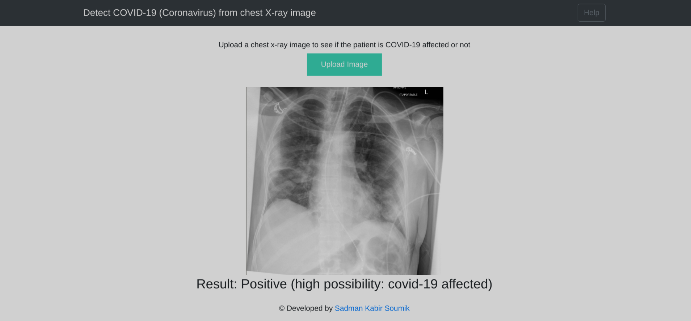

# detect-covid-19
Covid-19 detection from X-ray images using Computer Vision and deploying ML model to a Flask server. 

---
### Run the project:
 - Clone the project in your local environment.
 - Directory structure of this project: 
 ```
├── dataset
│   ├── covid
│   └── normal
├── ml_models
├── static
│   ├── css
│   ├── image
│   └── js
├── templates
└── uploads

 ```
 - Install required packages; command:  
 ```
 $ pip install requirements.txt
 ```
 - or, you can also create a conda environment using the `conda.yaml` file. command:  
 ```
 $ conda env create -f conda.yaml
 ```
 - Run the machine learning(ML) code to generate ML model weights, command:

 ```
 $ python ml_train.py
 ```
 - Model will be saved in the `ml_models` directory.
 - To serve the model to the flask server, command: 
 ```
$ export FLASK_APP=app.py
$ flask run 
 ``` 
 - Go to `http://127.0.0.1:5000/` web URL in your browser to see the web application. 

 ### Web UI

<tr>
    <td></td>
    <td></td>
</tr>

 ---

 Developed by Sadman Kabir Soumik 

